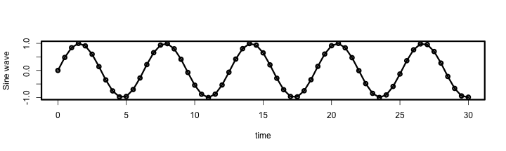
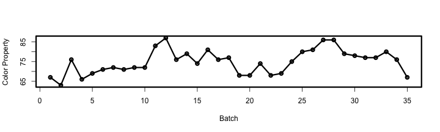

Handling Time-Series Data in R
========================================================
author: Cassie (Xi) Guo
date: 
font-family: 'Helvetica'

<style>

.reveal pre code {
  display: block; padding: 0.5em;
  font-size: 1.2em;
  line-height: 1.1em;
  background-color: white;
  overflow: auto;
  max-height: none;
  word-wrap: normal;
}


</style>


Outline
========================================================

- Introduction of time series in R
- R libraries for time series
    
    - 'stats'
    - 'zoo'
    - 'forecast'

- An example

Time series basics
========================================================

- Data collected from observations sequentially over time

- We use time series to: 

    - Understand the history
    
    - Model the data
    
    - Predict the future
    
============
<div class="midcenter" style="margin-left:100px; margin-top:100px;">
</img>
</div>


=======
<div class="midcenter" style="margin-left:100px; margin-top:100px;">
</img>
</div>


Two kinds of time series
========================================================

- Stationary (too good to be true)
- Nonstationary


    


============
"Experience with real-world data, however, soon convinces once that both stationarity and Gaussianity are fairy tales invented for the amusement of undergraduates." (Thompson 1994)


Libraries for time series
========

- stats
    
    - Basic functions

- zoo

    - Irregular time series
    
- forecast

    - Prediction & modeling


    
'stats' Package
======
- Create ts object

    - ts()
    
- plot

    - plot.ts() 
    
    - ts.plot()
    
- Trend analysis

    - lm()
    
    - decompose()

- Modeling

    - HoltWinters()


ts()
========================================================
- start, end, frequency


```
Error in file(file, "rt") : cannot open the connection
```
